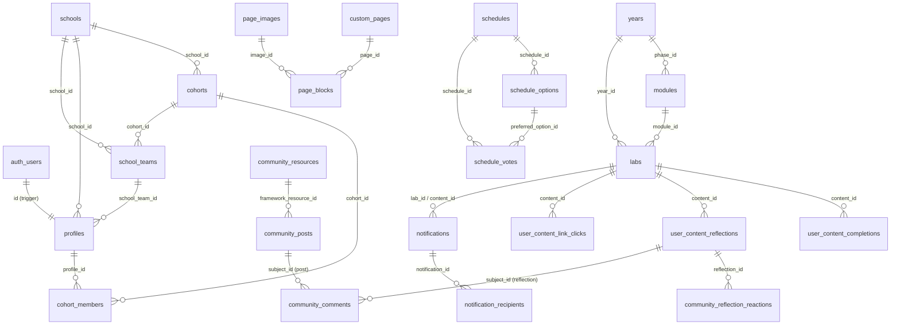

# Database Schema (Supabase / Postgres)

> **Status: DRAFT.** Built by replaying `scripts/*.sql` in order and checking the result against what the app code queries (`.from('…')` / `.storage.from('…')` in `app/`, `lib/`, `components/`). The live DB has **drifted from the SQL in the repo**. Several live tables and columns have no DDL in source control; see [Drift & known issues](#drift--known-issues). Items marked **(?)** are inferred from code only. The most reliable baseline is `supabase db dump --schema-only` from production. Commit that dump.

## Overview & naming gotchas

The database backs the "Wisdom At Work" fellows portal: curriculum, progress, reflections, library, community, notifications, scheduling and CMS pages. Every app table lives in `public`. Users live in `auth.users` and are mirrored into `public.profiles`.

| Table name | What it really is | Notes |
|---|---|---|
| `years` | **Phases** | Historically "Year One/Two/Three". The UI says "Phase". |
| `modules` | Modules inside a phase | FK column is `phase_id` (→ `years.id`), not `year_id`. |
| `labs` | **Content items** (readings, videos, live sessions…) | Originally "labs". Since 022/024 each row is one content item. `labs.year_id` is still present and NOT NULL. |
| `cohorts` | **School Teams** (a school's leadership team) | Not the A/B/C cohort. `cohorts.current_year` is 1–3. |
| `profiles.cohort` | The **A/B/C cohort** letter | Plain text with a CHECK constraint, **not** an FK to `cohorts`. Drives curriculum gating. |
| `cohort_members` | Membership in a School Team | `(cohort_id → cohorts, profile_id → profiles)` |
| `school_teams` | New (school × cohorts-row) entity | Being introduced by the in-progress migration (see below). |
| `notifications` | Formerly `announcements` | Renamed in 046. |
| `community_resources` | **Library** items | Powers `/resources`. |
| `user_content_*` | Per-user progress keyed on `labs.id` | `content_id` is TEXT. |

IDs: `years`, `labs` and `modules` use **TEXT** PKs (default `gen_random_uuid()::text`, added in 023/024). Everything else uses `uuid`.

Roles: the code uses `profiles.role ∈ {'fellow','facilitator','admin'}` (`lib/roles.ts`). The original 001 CHECK allows `'learner','facilitator','admin'` with default `'learner'`. No migration in the repo switches `learner` → `fellow`, but the live DB clearly allows `'fellow'` (**drift**).

## Entity relationships (live core)



`community_comments.subject_id` is polymorphic and has no FK. Two triggers delete orphaned comments (050).

---

## Tables by domain

Legend: **Live** = queried by current code. **Unused** = exists in SQL, never queried. **Missing** = queried by code, no DDL in repo.

### Users, profiles, auth

| Table | Status | Purpose / key columns | FKs & constraints |
|---|---|---|---|
| `profiles` | Live | One row per auth user. `full_name, email, title, avatar_url, role, school_id, cohort (A/B/C), bio (037)`. Community fields from 049: `linkedin_url, twitter_url, website_url, looking_for, willing_to_help, years_in_education, community_role, featured_member_from/until`. `school_team_id` (057). | `id → auth.users` cascade. `school_id → schools` set null. `school_team_id → school_teams` set null. `cohort IN ('A','B','C')`. Unique index on `lower(email)` (032). |
| | **Missing cols** | `deactivated_at` (used widely for soft-deactivate). `headline`, `community_role_label`, `profile_image_url` (only in `admin/community/moderation`) **(?)** | |
| `invitations` | Live | Invite tracking: `email (unique), full_name, title, role ('fellow','admin','facilitator'), cohort, school_id, status (pending/sent/accepted/expired/revoked/failed), invited_by, last_sent_at, expires_at, accepted_at, supabase_user_id, email_provider_id, last_error` | 046. RLS admin only. |
| `email_login_codes` | Live | First-party 6-digit login codes: `email, code_hash (sha256+salt), salt, expires_at, used_at`. 10-minute, single-use. | 047. RLS enabled, **no policies** (service role only). |

**Auth trigger (002):** `on_auth_user_created` runs after an insert on `auth.users` and calls `public.handle_new_user()` (security definer). That inserts `profiles(id, email, full_name)`, with `full_name = raw_user_meta_data.full_name` or else the email local part. The new row gets the column-default role (`'learner'` per 001; the live default is unknown). The invite flow (`lib/invitations/invite.ts → applyProfileEnrichment`) then sets `role, title, cohort, school_team_id`.
`set_updated_at()` triggers keep `updated_at` current on `profiles`, the community tables and `lab_content_blocks`.

### Schools, teams, cohorts

| Table | Status | Purpose / key columns | FKs & constraints |
|---|---|---|---|
| `schools` | Live | `name, icon_url (002), description, location, contact_email, website_url, logo_url (053)` | |
| `cohorts` | Live | **School Team** (e.g. "BTA Leadership Team"). `school_id, name, current_year smallint 1–3` | `school_id → schools` cascade |
| `cohort_members` | Live | PK `(cohort_id, profile_id)`. Membership still drives the RLS for announcements and school-team audiences. | cascade both |
| `school_teams` | Live (new) | `school_id, cohort_id, name`. `UNIQUE(school_id, cohort_id)` | 057. cascade to schools and cohorts. **No RLS enabled** (see issues). |

#### Cohort A/B/C vs `cohorts` table
- `profiles.cohort` holds the **A/B/C** letter (the program stage/intake). It is used for curriculum gating, library gating, `notifications.cohort_codes` and team-progress RLS (027).
- `cohorts` rows are **school leadership teams**. They are used for `cohort_members`, `notifications.school_team_ids` (these hold `cohorts.id` values despite the name) and `sessions.cohort_id`.
- The 057 backfill names each `school_teams` row "<School> - Cohort A/B/C" by mapping `cohorts.current_year` 1/2/3 → A/B/C. That mapping is a heuristic: nothing else in the schema ties `current_year` to a cohort letter.

### Curriculum (Phase → Module → Content)

| Table | Status | Purpose / key columns | FKs & constraints |
|---|---|---|---|
| `years` (phases) | Live | `id text, order_index, title, description, cohorts text[] NOT NULL default '{}'` | CHECK `cohorts <@ {A,B,C}` (019) |
| `modules` | Live | `id text, phase_id, title, description, order_index, cohorts text[] (nullable)` | `phase_id → years` cascade (024). RLS 025. |
| `labs` (content items) | Live | `id text, year_id, module_id (NOT NULL), order_index, title, subtitle, description, category content_category, resource_type content_resource_type, body, url, duration_minutes, scheduled_at, reflection_enabled, reflection_prompt, cohorts text[] (nullable)`. Legacy: `scheduled_date, is_lab`. | `year_id → years`, `module_id → modules` (both cascade). Partial index on `scheduled_at` where `resource_type='live_session'`. |
| `sessions` | Live (light) | Cohort-scoped live sessions: `cohort_id, lab_id, title, session_type, starts_at, ends_at, zoom_link` | read in `lib/dashboard-data.ts` with `session_facilitators` |
| `session_facilitators` | Live (embed) | PK `(session_id, profile_id)` | |
| `session_attendance` | Unused | | |
| `lab_content_blocks` | Unused (legacy, 010) | Superseded by columns on `labs` (022) | |

Enums:
- `content_category`: before_lab, during_lab, after_lab, general_resources, wisdom_coaching, community_of_practice.
- `content_resource_type`: reading, video, slide_deck, pdf, worksheet, reflection_prompt, survey, external_link, protocol, companion_guide, assignment, other, live_session (028).
- `lab_phase` and `lab_block_type` are legacy (010).

#### Cohort gating semantics (as implemented in `lib/curriculum.ts` / `lib/cohorts.ts`)
Admins and facilitators bypass gating in app code. A fellow must pass **every** level: phase → module → item.

| Value | `years.cohorts` | `modules.cohorts` / `labs.cohorts` |
|---|---|---|
| `NULL` | n/a (NOT NULL) | **inherit**: item → module → phase |
| `'{}'` | **hidden from all fellows** | **locked from all fellows** |
| `'{A,…}'` | visible only to listed cohorts | override: only the listed cohorts |

- A fellow with no `profiles.cohort` sees **no** gated content.
- ⚠ The 019 SQL comments say "empty = open to all". The **code does the opposite** (empty = hidden). Trust the code.
- Library (`community_resources`): `is_universal = true` means "Further Reading", visible to everyone. Otherwise the row is gated on `cohorts` by **strict** match (`fellowCanAccess`). 035's comment and `cohortReleasedFor()` describe cumulative A<B<C access, but `/resources` uses strict matching.

### Progress, completions, reflections

| Table | Status | Purpose / key columns | Notes |
|---|---|---|---|
| `user_content_completions` | Live | PK `(profile_id, content_id→labs)`, `completed_at` | RLS: own rows. Cohort peers (same `profiles.cohort`) and admins can read (027). |
| `user_content_link_clicks` | Live | PK `(profile_id, content_id)`, `clicked_at` | Gate for "mark complete". Own rows only. |
| `user_content_reflections` | Live | PK `(profile_id, content_id)`. `id uuid UNIQUE` (050), `response, submitted_at, visibility ('public','cohort','private', default public)` | Some code selects `body`, `created_at` and joins `content_blocks` (see issues). |
| `community_reflection_reactions` | Live | PK `(reflection_id, profile_id, kind)` | 051. Read: all authenticated. Write/delete: own rows. |
| `user_year_progress`, `user_lab_progress` | Unused (001) | | |
| `reflection_survey_submissions`, `reader_responses`, `learning_journal_entries` | Unused (001) | 010 dropped their `lesson_id` FKs via CASCADE | |
| `user_block_completions` | Unused (010) | | |
| `lessons`, `resources`, `user_lesson_progress`, `user_resource_progress` | **Dropped** in 010 | | `resources` is still queried by the maintenance API (issues) |

### Library

| Table | Status | Key columns |
|---|---|---|
| `community_resources` | Live | `title, description, url, author (043), resource_type, tags text[], cohorts text[] default '{}', is_universal, is_pwf_protocol (049), cover_url (040), created_by`. Code also reads `category` (legacy; no DDL in repo **(?)**). |

⚠ `resource_type` has two CHECK constraints if 018 and 033 both ran: `{article,video,podcast,book,pdf,link}` (018) and `{document,video,link,reading}` (033). Only `video` and `link` would pass both. 033's header describes a different pre-existing table, so the live table probably did not come from 018.

### Community

| Table | Status | Key columns / notes |
|---|---|---|
| `community_posts` | Live | What code uses: `kind ('post','story','announcement','reflection','win','question')` (041 CHECK), `title, excerpt, body, created_by, published_at, cover_url, media_url, star_rating, visibility ('public','cohort','school_team'), visibility_scope_id, framework_resource_id → community_resources, ask_category (general/instructional/school_team/waw), ask_status (open/answered/closed), featured_at, is_archived, accepted_answer_comment_id → community_comments`. ⚠ The 018 DDL (`slug NOT NULL`, `category`, `published`, `author_id`, `cover_image_url`) does **not** match live usage. `kind`, `created_by`, `visibility*`, `media_url`, `star_rating` and `cover_url` have no DDL. |
| `community_comments` | Live | Polymorphic: `subject_type ('post','reflection'), subject_id, profile_id, parent_comment_id, body (1–4000 chars), deleted_at (soft delete)`. Anyone authenticated can read. Authors write. |
| `community_post_reactions` | Unused (049) | PK `(post_id, profile_id, kind)` |
| `community_events` | Live | `title, description, location, starts_at, ends_at, event_type ('workshop','lab_session','meet_up','webinar')` (037). Code also uses `join_url` (admin write) **and** `meeting_url` (team-extras read), plus `published_at`. None of these three has DDL (issues). |

### Notifications

| Table | Status | Key columns / notes |
|---|---|---|
| `notifications` (ex-`announcements`) | Live | Base columns come from an **untracked** `announcements` DDL **(?)**: `title, body, pinned, author_id, published_at (default now()), audience_scope, cohort_id, year_id`. Added in 044–046: `content_id → labs, audience_scope ('global','cohort','school_team','users','year'), cohort_codes text[] ⊆ {A,B,C}, school_team_ids uuid[] (= cohorts.id), user_ids uuid[], kind ('announcement','reminder','alert'), status ('draft','scheduled','sending','sent','failed','cancelled'), scheduled_for, sent_at, cta_label, cta_url, lab_id, module_id, session_id, email_enabled, email_subject` |
| `notification_recipients` | Live | One row per (notification, profile), unique: `email, email_status (pending/skipped/sent/failed), email_provider_id, email_sent_at, email_error, read_at, dismissed_at (048)` |

RLS: admins have full access. Everyone else sees a notification only when `status='sent'` **and** it matches their audience. Audience matching: `global`; `cohort` via `profiles.cohort`; `school_team` via `cohort_members`; `users` via `auth.uid()`. Recipients read and update their own `notification_recipients` rows.

### Scheduling (polls)

| Table | Status | Key columns |
|---|---|---|
| `schedules` | Live | `title, description, event_date (NOT NULL), start_time, end_time, location, meeting_link, capacity, status schedule_status ('polling','scheduled','completed'), is_poll, voting_closes_at, created_by_admin, selected_option_id` (040). Code also inserts `module_id` (no DDL in 040; exists only in the legacy 01-create-schema) **(?)** |
| `schedule_options` | Live | `schedule_id, start_time, end_time timestamptz, order_number` |
| `schedule_votes` | Live | `user_id → auth.users, schedule_id, preferred_option_id`, `UNIQUE(user_id, schedule_id)`. ⚠ `app/schedule/[id]/page.tsx` uses a non-existent `option_id` column. |

RLS (026_fix_critical_rls): authenticated users read. Staff write. Users insert and delete their own votes. There is **no update policy on votes**.

### Custom pages / CMS

| Table | Status | Key columns |
|---|---|---|
| `custom_pages` | Live | `title, slug (unique), description, is_published, show_in_menu (033), header1..3 (migrate-about / setup-database.ts), created_by → profiles`. Code writes `cover_image_url` (no DDL). |
| `page_blocks` | Live | `page_id → custom_pages cascade, block_type ('text','image','combined'), order_number, title, content, metadata jsonb, image_id → page_images (036)` |
| `page_images` | Live | Image library: `url, filename, width, height, alt_text, size_bytes, mime_type` (+ `uploaded_by` if 052 created it) |
| `admin_page_content` | Live | Editable slots on admin pages: `page_id text, slot_name, order_index, title, content, block_type, image_url, image_alt` with `UNIQUE(page_id, slot_name, order_index)`. RLS: admin only. |
| `navigation_labels` | Live | Single row of nav labels: `dashboard, about, library, community` (`lib/sql/migrations/navigation_labels.sql`). Anyone reads. Admins update. |

CMS RLS is layered: 030 (admin), then 026_fix_critical_rls (staff), then 052 (admin or creator). Postgres ORs the permissive policies together, so **anyone** can read `page_blocks`, `custom_pages` and `page_images` (026's `using (true)`). Unpublished pages are therefore readable too.

### Email logs, audit, maintenance

| Table | Status | Notes |
|---|---|---|
| `email_logs` | **Unused** (048) | The `/admin/email-logs` UI instead builds its view from `invitations` and `notification_recipients` (`lib/email/logs.ts`). Its RLS checks `auth.users.role = 'admin'`, which is always `'authenticated'`, so non-service reads return nothing. |
| `maintenance_audit_log` | Live | `admin_id → profiles (restrict), action_type, item_type, item_id text, item_name, details jsonb`. Admins read and insert (only with `admin_id = auth.uid()`). |

---

## RLS summary

Helpers: `is_staff()` (role in facilitator/admin) and `is_cohort_member(uuid)` (003), both security definer. ⚠ `is_admin()` is used by 018's policies but is **defined nowhere** in the repo.

| Area | Read | Write |
|---|---|---|
| Curriculum (`years`, `modules`, `labs`) | all authenticated | staff |
| `schools` | all authenticated | staff |
| `cohorts`, `cohort_members` | staff or members | staff |
| `profiles` | self, staff, or users sharing a `cohort_members` team | self (insert/update) |
| `user_content_*` | owner; completions also cohort-letter peers and admins | owner |
| `user_content_reflections` | owner; **any authenticated user if visibility ≠ private** (050) | owner; staff update/delete (052) |
| Community posts/resources/events | authenticated (posts: `published` or admin per 018 **(?)**) | admin via `is_admin()` |
| Comments / reactions | authenticated | own rows |
| `notifications` | audience-matched and `status='sent'` | admin |
| `invitations`, `email_login_codes`, `email_logs`, `admin_page_content`, `maintenance_audit_log` | admin / service role only | admin / service role |
| CMS tables | public (anon too) | staff/admin |
| `schedules*` | authenticated | staff; votes: own |
| `school_teams` | **no RLS** | **no RLS** |

Much of the server code uses `createAdminClient()` (service role). RLS mainly protects direct PostgREST and browser-client access.

⚠ Reflection visibility `'cohort'` is **not enforced** by RLS. The 050 policy (`visibility <> 'private'`) ORs with 052's staff-only cohort policy, so every authenticated user can read cohort-visibility reflections.

## Storage buckets

| Bucket | Public read | Write | Created by | Used in |
|---|---|---|---|---|
| `avatars` | yes | users, only inside `{auth.uid()}/…` | 039 | `app/profile/actions.ts` |
| `resource-covers` | yes | admin/facilitator | 040_resource_covers | `app/resources/actions.ts` |
| `custom-page-images` | yes | admin (insert/delete) | `scripts/setup-storage.sql`; also auto-created by `lib/custom-pages/setup.ts` | custom-page image upload/delete API |
| `course-files` | **no** (no fellow policy; served only via `/api/files/[kind]/[id]` with 60 s signed URLs) | admin/facilitator | 058 | `app/api/files/[kind]/[id]/route.ts`; `labs.file_path`, `community_resources.file_path` |

`schools.icon_url` and older page images point at Vercel Blob URLs. Custom-page uploads have since moved to Supabase Storage.

## school_teams migration

**Why.** A fellow's team was stored twice: `profiles.school_id` and a `cohort_members` row. The two can disagree. `cohorts.school_id` also ties each cohort to exactly one school, so "School X's Cohort A" and "School Y's Cohort A" can't share a cohort row.

**Target model.** `school_teams(id, school_id → schools CASCADE, cohort_id → cohorts CASCADE, name, created_at, UNIQUE(school_id, cohort_id))`. One row is one team, meaning one school's slice of a cohort. Profiles link to it through `profiles.school_team_id → school_teams ON DELETE SET NULL`. `cohort_members` stays and is kept in sync, because curriculum, sessions and labs still key off it.

### Phases and status

| Phase | What it does | Status |
|---|---|---|
| 1 – schema | `scripts/057_school_teams_migration_phase1.sql`, one transaction, idempotent. Creates the table and 3 indexes, adds `profiles.school_team_id`, inserts one team per cohort with a non-null `school_id` (name `"<School> - Cohort A/B/C"` from `current_year` 1/2/3), and sets `school_team_id` for `role='fellow'` profiles from `cohort_members`. Prints counts with `RAISE NOTICE`. | **Unknown whether it has been applied.** The repo docs say "pending". But the merged Phase 2 code selects `school_team_id` and embeds `school_teams(...)` in `getCurrentUser`, which fails if the migration has not run. If prod login works, 057 has been applied. Check with the queries below. |
| 2 – code | Commit `4fd570c`, 2026-06-18, the same day as Phase 1 (the planned 1-week soak was skipped). Changes `lib/auth-server.ts`, `lib/team-extras.ts`, `lib/invitations/invite.ts`, `app/admin/schools/{page.tsx,actions.ts}`, `app/admin/users/page.tsx`. | Merged. No changes since. **Incomplete:** `app/admin/users/actions.ts` and the form components were not updated (see bugs). |
| 3 – cleanup | `ALTER TABLE cohorts DROP COLUMN school_id` (optional). | Not started. **Blocked:** code still uses `cohorts.school_id`. `createCohortAction` inserts it, and 057's backfill and any future team creation derive from it. |

### Executing / verifying Phase 1

Pre-checks: take a backup (Supabase daily auto-backup, or `pg_dump`). Optionally run `node scripts/audit_school_teams_model.js` (it needs `NEXT_PUBLIC_SUPABASE_URL` and `SUPABASE_SERVICE_ROLE_KEY`). It lists cohorts, member counts, `profiles.school_id`-vs-cohort mismatches and fellows in more than one cohort. Resolve any of these first: a fellow in more than one cohort gets an arbitrary team.

Run it in either of these ways:
- In the Supabase SQL Editor, paste the whole of `scripts/057_school_teams_migration_phase1.sql` and run it.
- `psql "$POSTGRES_URL" -f scripts/057_school_teams_migration_phase1.sql`

Use the 057 file, not the SQL in the old proposal doc: that version had invalid inline `INDEX` clauses and no `school_id IS NOT NULL` filter. **Don't rely on `scripts/execute-phase1-migration.{js,mjs}`.** The `.js` calls a non-existent `execute_sql` RPC and ignores the errors on steps 2–5. Its counts always print 0 (`data.length` with `head: true`). The `.mjs` only probes for existence, and it checks the wrong error code.

Verify:
```sql
select count(*) from school_teams;                                   -- = cohorts with school_id
select count(*) from cohorts where school_id is not null
  and id not in (select cohort_id from school_teams);                -- expect 0
select column_name from information_schema.columns
 where table_name='profiles' and column_name='school_team_id';       -- 1 row
select indexname from pg_indexes where indexname in
 ('idx_school_teams_school_id','idx_school_teams_cohort_id','idx_profiles_school_team_id'); -- 3 rows
select count(*) from profiles p join cohort_members cm on cm.profile_id=p.id
 where p.school_team_id is null;                                     -- fellows 0; non-fellows expected (see bugs)
```

### Remaining steps
1. Confirm whether 057 is applied in prod, and record the result here.
2. Fix the Phase 2 bugs below. The biggest one: the invite and add-member flows are broken.
3. Enable RLS on `school_teams`.
4. Only then consider Phase 3. Before dropping the column, move `createCohortAction`/team creation to write `school_teams`, and remove every `cohorts.school_id` read and write.

### Rollback

- **Phase 2 (code):** `git revert 4fd570c && git push`, then let Vercel redeploy. The DB is left untouched. The old code ignores `school_team_id`, but `cohort_members` rows written since Phase 2 remain valid.
- **Phase 1 (schema):** revert Phase 2 **first**. Otherwise `getCurrentUser` breaks for every user.
  ```sql
  begin;
  alter table public.profiles drop column if exists school_team_id;
  drop table if exists public.school_teams;
  commit;
  ```
  This loses nothing that can't be rebuilt. `profiles.school_id` and `cohort_members` are untouched, and re-running 057 rebuilds everything.
- **Phase 3 (if it is ever run):**
  ```sql
  begin;
  alter table public.cohorts add column school_id uuid references public.schools(id) on delete cascade;
  update public.cohorts c set school_id = st.school_id from public.school_teams st where c.id = st.cohort_id;
  create index if not exists cohorts_school_idx on public.cohorts(school_id);
  commit;
  ```
  This is lossy if a cohort has more than one team: an arbitrary school wins.
- **Emergency:** restore the backup or use PITR.

### Known bugs in the current (Phase 2) code
- **Mixed id types.** `buildUserFromProfile` sets `schoolTeamId = profile.school_team_id ?? profile.school_id`, so the value is sometimes a `school_teams.id` and sometimes a `schools.id`. `requireAdmin` doesn't even select `school_team_id`, so it always falls back. `lib/team-extras.ts` filters `profiles.school_team_id = schoolTeamId`, so a user on the fallback gets an empty team. Community `visibility_scope_id` for `school_team` posts stores the same mixed value.
- **Add member always fails.** `addMemberAction` reads `formData.get('schoolTeamId')`, but `AddMemberForm` sends `cohortId` (and `page.tsx` passes it `team.cohort_id`). Adding a member on `/admin/schools` therefore always fails with "Missing school team or profile".
- **Invitees no longer join a team (regression).** The invite, bulk-invite and resend-invite paths in `app/admin/users/actions.ts` pass `cohorts.id` as `payload.schoolTeamId`. `applyProfileEnrichment` looks the value up in `school_teams.id`, finds nothing, and **skips both** the `cohort_members` insert and `school_team_id`.
- **Team change from `/admin/users` is half done.** It (`updateCohortAction` in `users/actions.ts`) rewrites only `cohort_members`. Remove-member on `/admin/schools` deletes only `cohort_members`. In both cases `school_team_id` goes stale: the fellow stays hidden from the "unassigned" list, and keeps seeing their old teammates.
- **New teams are invisible.** No code inserts into `school_teams`, so a team (cohort) created in the admin UI after 057 has no row and does not appear on `/admin/schools`. Renaming a team updates `cohorts.name`, but the page shows `school_teams.name`, so the old name stays on screen.
- **Editing a team resets its year.** `TeamMenu` is passed `initialYear={1}`, so saving a team edit resets `cohorts.current_year` to 1 unless the admin changes it.
- **Only fellows were backfilled.** 057 sets `school_team_id` only for `role = 'fellow'`. Facilitators and admins who are on teams are left unset, and `team-extras` then leaves facilitators out of the team.
- **School delete guard misses members.** `deleteSchoolAction` checks only `profiles.school_id`. Members linked only through `school_team_id` don't block the delete: the cascade silently unassigns them.
- **No RLS on `school_teams`.** It is readable and writable with the anon key through PostgREST.

## Setting up a fresh database

⚠ **No script in the repo produces the live schema from scratch.**
- `scripts/setup-db.mjs` and `lib/db-init.ts` create a legacy, unrelated schema (`users`, `programs`, `enrollments`…) through a non-existent `exec_sql` RPC. Do not use them.
- `scripts/setup-database.ts` only adds `custom_pages.header1..3` and seeds the About page, also via `exec_sql`.
- `01-create-schema.sql` is the same legacy schema and is superseded by `001_create_schema.sql`.

Recommended: restore from a `pg_dump --schema-only` of production. The best-effort replay from repo files is below:

1. `001_create_schema` → `002_add_school_icon` → `002_auth_triggers` → `003_enable_rls`
2. **Create `public.is_admin()` manually**, for example `select exists(select 1 from profiles where id = auth.uid() and role = 'admin')`.
3. Skip the seeds `004`/`005`: 024 sets `labs.module_id NOT NULL` and fails if `labs` has rows. Then run `010_flatten_to_lab_blocks` (it drops `lessons`/`resources`).
4. `018` → `019` → `020` → `022` → `023` → `024` → `025_content_durations_and_completions` → `025_modules_rls` → `026_reflections_and_link_clicks` → `027` → `028`
5. `030_custom_pages` → `032_add_page_images_columns` (no-op) → `033_add_show_in_menu_column` → `033_library_resource_types_and_tags` → `035_fix_page_blocks_columns` → `035_library_universal_flag` → `036_add_image_id_to_page_blocks` → `migrate-about.sql` (only the header-columns `ALTER`; its insert uses `created_by = 'system'`, which is not a valid uuid)
   - **Skip** `031_fix_page_blocks_schema` (its `ADD CONSTRAINT … ON CONFLICT DO NOTHING` is invalid SQL) and `034_fix_page_images_schema` (`page_images.page_id` does not exist).
   - `052_custom_pages` is an alternate definition. Its `create table if not exists` statements are no-ops after 030, but its policies are still added. On a DB where 030 has not run, it fails, because `page_blocks` references `page_images` before that table is created.
6. `037` → `039` → `040_create_schedules_table` → **then** `026_fix_critical_rls`. That file is misnumbered: it needs the tables from 030 and 040.
7. `040_resource_covers_bucket_and_column`. **Before 041/044**, hand-write the DDL that is missing: `community_posts.kind`/`created_by`/`visibility`/`visibility_scope_id`/…, the base `announcements` table, `profiles.deactivated_at`, and the `profiles.role` CHECK including `'fellow'`.
8. `041` → `042` → `043` → `044` → `045` → `046_notifications_unify` → `047` → `048_email_logs` → `048_notification_recipients_dismissed` → `049` → `050` → `051_ask_accepted_answer` → `051_community_reflection_reactions` → `052_reflections_rls` → `053_schools_enhanced` → `054` → `055` → `056` → `057`
9. `lib/sql/migrations/navigation_labels.sql`, `scripts/setup-storage.sql`
10. Optional seed/demo data (**never in prod**; they create auth users with shared passwords): `014`, `029`, `030_fix_demo_fellow_bcrypt_cost`, `031_rotate_demo_password`, `032_fix_fellow_cohort_and_dedupe_profiles` (it does, however, add the unique `lower(email)` index, which you want), `034/036_seed_library_*`, `038`, `046_seed_users`, `053_seed_about_page`.

`scripts/clear-test-data.sql` is broken: it references a non-existent `user_content_progress` table and uuid-table sequences.

## Drift & known issues

**Used in code, missing from SQL:**
- `reflection_reactions`: used by the live `components/curriculum/reflection-reactions.tsx` through `app/(curriculum)/phases/reflection-actions.ts`, with `user_id` and `reaction_type`. The SQL only has `community_reflection_reactions` (`profile_id`, `kind`).
- `resources`, `reflections`, `lab_activities`, `user_invitations`: queried by the live `/api/admin/maintenance/{library,content,users}` routes behind the `components/admin/maintenance/*` UI.
- `user_profiles`: `app/pages/[slug]/page.tsx` (should be `profiles`).
- `programs`, `enrollments`: `app/programs/*`, `app/api/seed`, `lib/db-init.ts` (legacy).
- `content_blocks` embed and `user_content_reflections.body/created_at`: `lib/team-extras.ts`, `lib/community/load-dashboard.ts` (`loadRecentReflections`). `load-reflections.ts` correctly aliases `response as body`.
- Columns without DDL are listed per table above. Key ones: `profiles.deactivated_at`, the `community_posts.*` set, `community_events.join_url/meeting_url/published_at`, the base `notifications` columns, `custom_pages.cover_image_url`, `schedules.module_id`, `community_resources.category`.

**In SQL, unused by code:** `email_logs`, `community_post_reactions`, `lab_content_blocks`, `user_block_completions`, `user_year_progress`, `user_lab_progress`, `session_attendance`, `reflection_survey_submissions`, `reader_responses`, `learning_journal_entries`, `discussion_posts`. `lib/community/load-reflection-feed.ts` has no importers.

**Other:**
- `school_teams` has RLS disabled. With the anon key it is readable and writable through PostgREST.
- The 029 comment says `profiles.cohort` allows only A/B, but the CHECK constraint allows A/B/C.
